# [FE] 충북대학교 노바 홈페이지

## 서비스 소개

학술동아리 노바 동아리원들이 자료를 공유하고, 게시판을 통해 정보를 기록하
고, 공유하기 위해 진행되었습니다.

동아리원들은 게시판을 통해 자료 공유 및 질문을 할 수 있고, 임원들은 동아리원
들이 올린 자료들을 쉽게 수집하고 공유할 수 있습니다.

현재 1차 배포를 진행중이며

설문 응답 **20명중 18명**의 필요성을 참고로 개발을 진행중입니다.

데이터 보안과 지속성을 고려해 **온-프레미스** 형태로 서비스를 운영중입니다

## 페이지 URL

https://nova.cbnu.ac.kr

## 참여인원

|                       🍀 [권성민](https://github.com/kwonja)                        |                       🍀 [서범수](https://github.com/Seobeomsu)                        |                       🍀 [이진희](https://github.com/SinnoLn)                        |                        🍀 [김민주](https://github.com/Sanizzang)                        |                       🍀 [김상수](https://github.com/patrache)                        |
| :---------------------------------------------------------------------------------: | :------------------------------------------------------------------------------------: | :----------------------------------------------------------------------------------: | :-------------------------------------------------------------------------------------: | :-----------------------------------------------------------------------------------: |
|                                       FE/팀장                                       |                                           FE                                           |                                          BE                                          |                                           BE                                            |                                         BE/FE                                         |
|  |  |  |  |  |

## 기술스택

- Nextjs(app router)
- Typescript
- TurboRepo
- shadcn/ui
- TanStack Query
- react-hook-form
- zod
- Tailwind CSS
- zustand
- eslint
- prettier
- husky
- commitlint

## CI/CD

- Jenkins
- CPU i3, RAM 12GB 노트북

## 시스템 구조


## 주요 기술

### 모노레포 사용

```
📦 root
├─ 📂 apps
│  ├─ 📂 service      # 사용자용
│  └─ 📂 admin        # 관리자전용
├─ 📂 packages
│  ├─ 📂 ui           # 공통 UI 컴포넌트
│  └─ 📂 utils        # 공통 유틸 함수
├─ 📄 turbo.json      # Turborepo 설정 파일
└─ 📄 package.json    # 루트 패키지 설정
...

```

turbo를 사용해 빌드를 했던 내용은 캐싱을 진행했습니다 (캐싱전)51s -> (캐싱후)460ms
또한 병렬빌드를 통해 병목현상을 막을 수 있었습니다.

빌드전, pnpm build 를 사용해 빌드 테스트를 진행후 origin에 올리는 방식을 사용했는데, 빌드가 실패했을때 성공한 빌드의 경우(다른 프로젝트가 성공했을때) cache를 사용해 에러 수정후 빠른 빌드 테스트를 경험할 수 있었습니다.

shadcn/ui를 도입하면서 각 프로젝트에 필요로 하는 공통 컴포넌트의 중복 사용을 줄였습니다.

### TanStack Query

```
# 코드의 일부분 입니다
export const postKeys = {
  all: ["posts"] as const,
  lists: () => [...postKeys.all, "list"] as const,

  list: (filters: SearchFilter) => [...postKeys.listmain(), filters] as const, //전체보기

  typelists: (postType: PostType) => [...postKeys.lists(), postType] as const,

  typelist: (filters: SearchFilter, postType: PostType) =>
    [...postKeys.lists(), postType, filters] as const,

  details: () => [...postKeys.all, "detail"] as const,
  detail: (postId: string) => [...postKeys.details(), postId] as const,
}
```

Effective React Query Keys 문서를 참고해 query-key-factory 패턴으로 쿼리 키를 관리하고, 최신 데이터가 필요한 api에 관해서 무효화를 쉽게 하도록 구조화 하였습니다.

## 기능소개

### 노바 서비스

<table> <tr> <th>로그인</th> <th>회원가입</th> </tr> <tr> <td>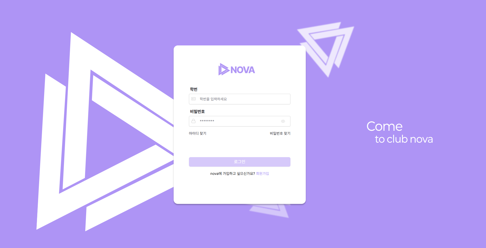</td> <td>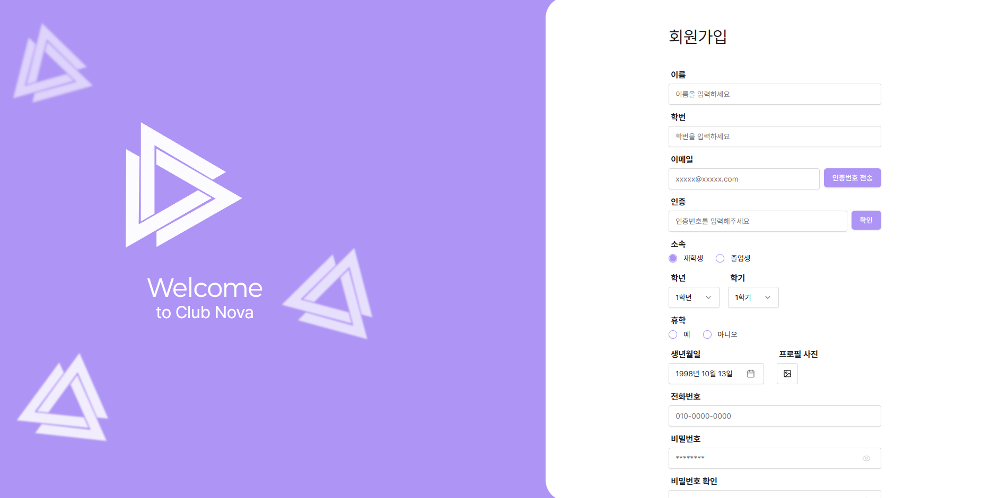</td> </tr> </table>
<table> <tr> <th>홈</th> <th>목록</th> <th>상세</th> </tr> <tr> <td>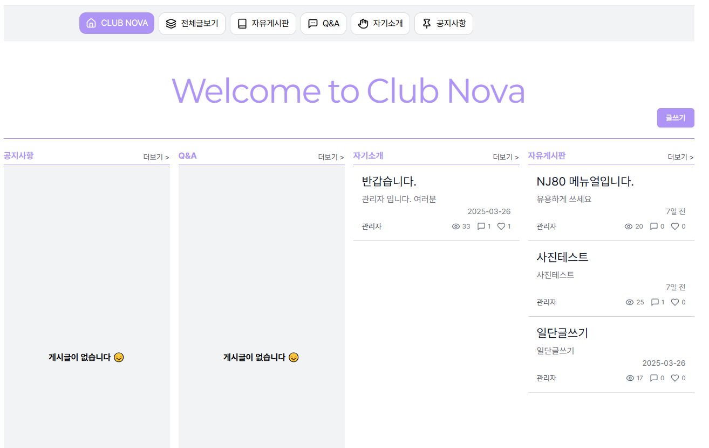</td> <td>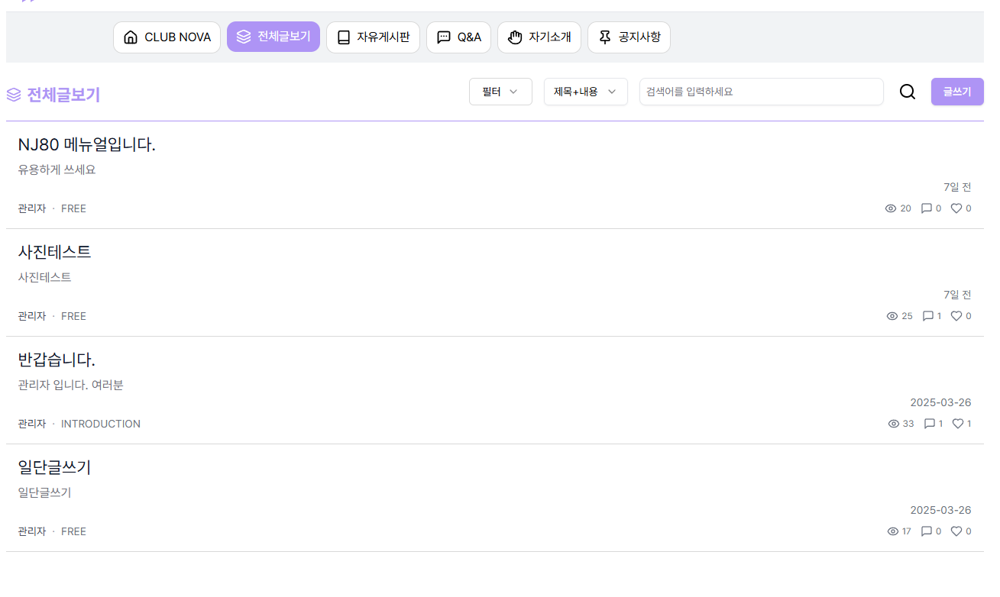</td> <td>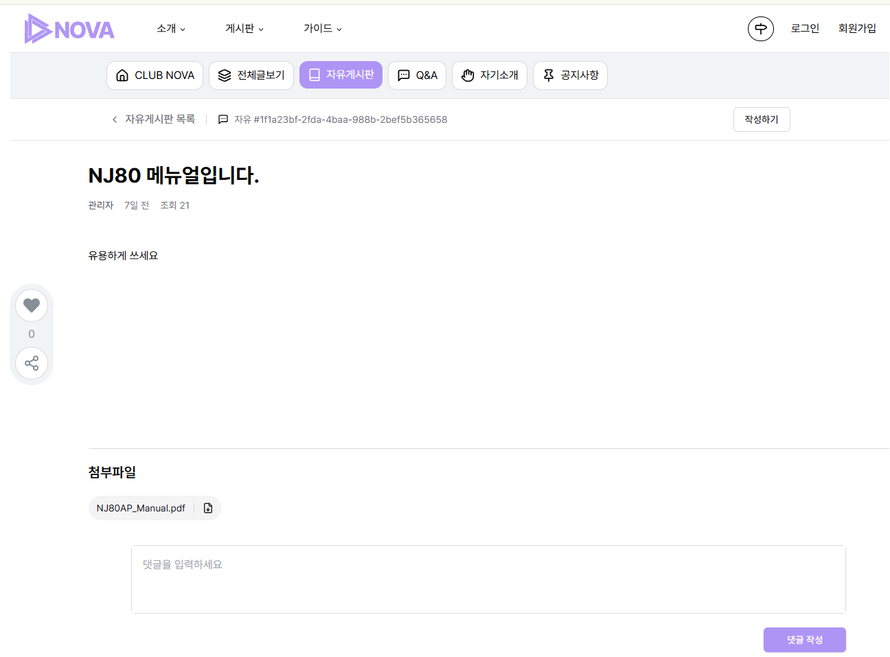</td> </tr> </table>
<table> <tr> <th>목록</th> <th>상세</th> <th>상세(확대)</th> </tr> <tr> <td>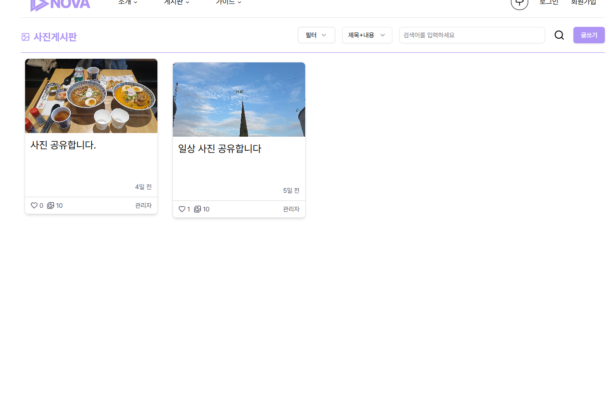</td> <td>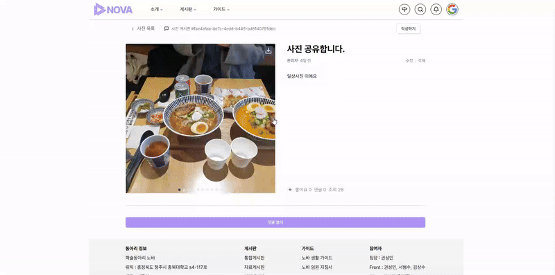</td> <td>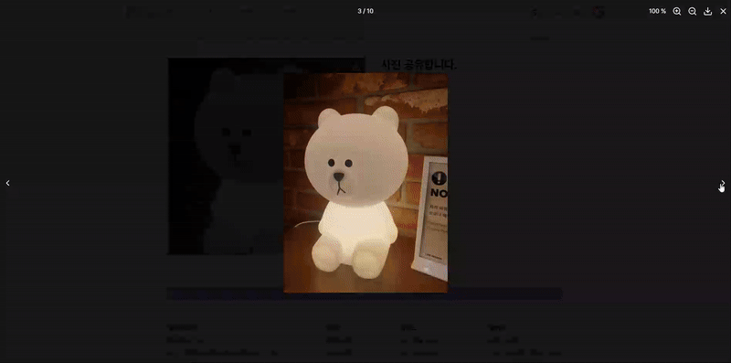</td> </tr> </table>
<table> <tr> <th>댓글/대댓글</th> <th>댓글/대댓글(gif)</th> </tr> <tr> <td>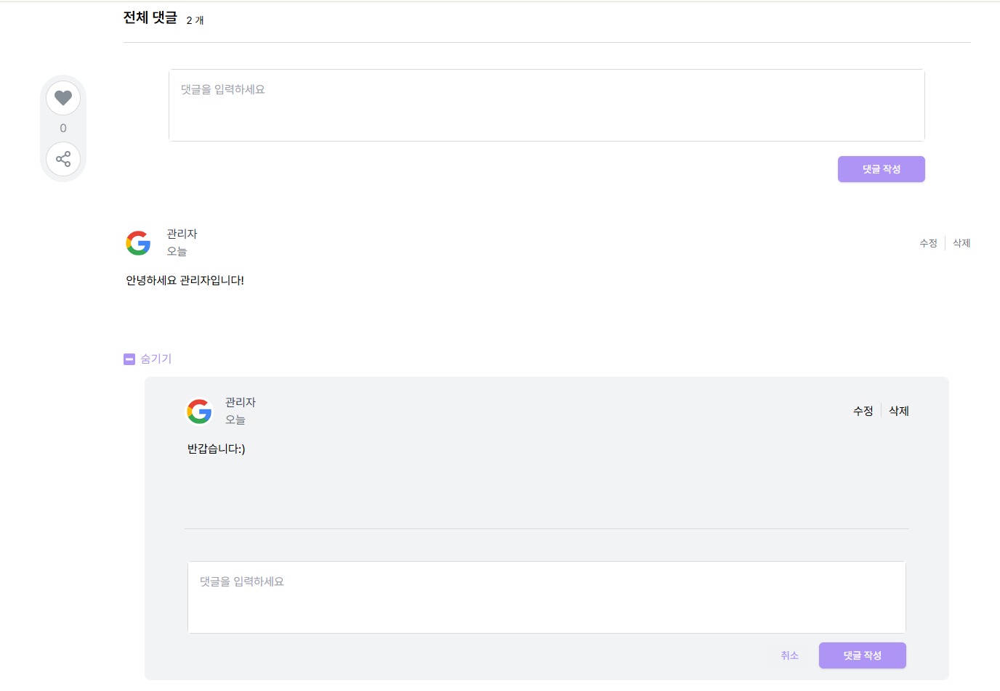</td> <td>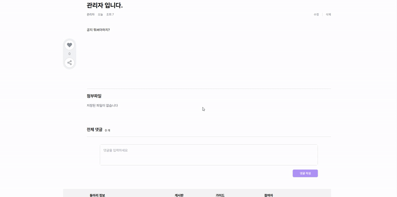</td> </tr> </table>
<table> <tr> <th>건의함</th> <th>건의상세</th> </tr> <tr> <td>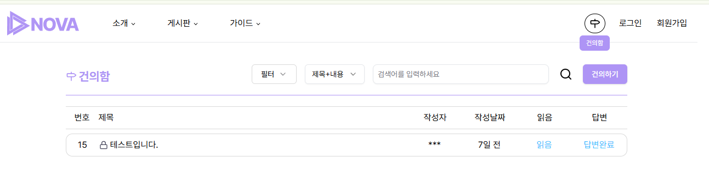</td> <td>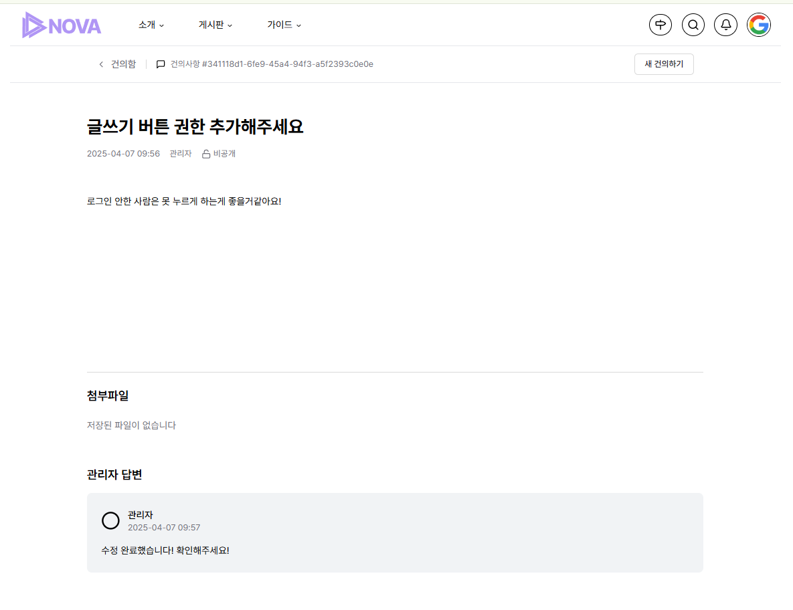</td> </tr> </table>

- 연혁, 동아리원, 임원 소개 추가 예정

### 관리자

- 작성 예정
- 핫픽스 테스트